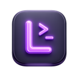

<p align="center">
  
</p>

<h1 align="center">Lena</h1>

<p align="center">
  A lightweight macOS menu bar app for storing and copying CLI commands.
</p>

---

**Features**

- Menu bar icon — always one click away
- Global hotkey `⌘⇧L` to open from anywhere
- Group commands by tool (git, Docker, ffmpeg, …)
- Full-text search across all commands and notes
- Syntax highlighting in the command editor
- Templates with `{{placeholder}}` variables
- Keyboard navigation `↑` `↓` `↵` to copy
- Data stored locally in `~/Library/Application Support/Lena/tools.json`

---

**Install**

Download `Lena-1.0.dmg` from [Releases](https://github.com/yannickboog/lena/releases), open it, and drag **Lena** into your Applications folder.

> Since the app is not notarized, right-click and select **Open** on first launch, or allow it via System Settings → Privacy & Security.
> Alternatively: `xattr -dr com.apple.quarantine /Applications/Lena.app`

---

**Build from source**

Requires Xcode 16+ and macOS 12+.

```bash
git clone https://github.com/yannickboog/lena
open Lena.xcodeproj
```

Press `⌘R` to build and run.

---

**License**

Apache License 2.0 – see [LICENSE](LICENSE).
